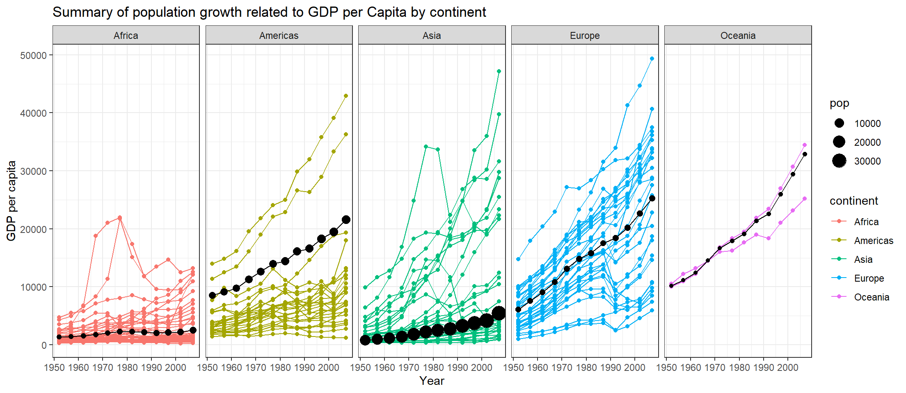

<<<<<<< HEAD


---
title: "Gapminder task 2"
date: "January 22, 2024"
gfm:
  code_fold: true
  code_tools: true
  code-line-numbers: true
execute:
  keep-md: true
---


I followed the video and used dplyr to wrangle the data


::: {.cell}

```{.r .cell-code}
library(tidyverse)
```

::: {.cell-output .cell-output-stderr}

```
Warning: package 'ggplot2' was built under R version 4.4.1
```


:::

::: {.cell-output .cell-output-stderr}

```
── Attaching core tidyverse packages ──────────────────────── tidyverse 2.0.0 ──
✔ dplyr     1.1.4     ✔ readr     2.1.5
✔ forcats   1.0.0     ✔ stringr   1.5.1
✔ ggplot2   3.5.1     ✔ tibble    3.2.1
✔ lubridate 1.9.3     ✔ tidyr     1.3.1
✔ purrr     1.0.2     
── Conflicts ────────────────────────────────────────── tidyverse_conflicts() ──
✖ dplyr::filter() masks stats::filter()
✖ dplyr::lag()    masks stats::lag()
ℹ Use the conflicted package (<http://conflicted.r-lib.org/>) to force all conflicts to become errors
```


:::

```{.r .cell-code}
library(gapminder)
```

::: {.cell-output .cell-output-stderr}

```
Warning: package 'gapminder' was built under R version 4.4.1
```


:::
:::


## Here is the graph needed for the assignment


::: {.cell}

```{.r .cell-code}
                    #Removes Kuwait and makes pop in the thousands

gapminder1 <- gapminder%>%
  
  filter(country != "Kuwait") %>% 
  
  mutate(pop = pop/100000)

                    #New Data set with weighted averages and 2.5 times pop to match the template graph

gapped <- gapminder1 %>% 
  group_by(year, continent) %>% 
  summarise(
      GDP = weighted.mean(gdpPercap, pop, na.rm=T),
      pop= pop*2.5
  )
```

::: {.cell-output .cell-output-stderr}

```
Warning: Returning more (or less) than 1 row per `summarise()` group was deprecated in
dplyr 1.1.0.
ℹ Please use `reframe()` instead.
ℹ When switching from `summarise()` to `reframe()`, remember that `reframe()`
  always returns an ungrouped data frame and adjust accordingly.
```


:::

::: {.cell-output .cell-output-stderr}

```
`summarise()` has grouped output by 'year', 'continent'. You can override using
the `.groups` argument.
```


:::
:::

::: {.cell}

```{.r .cell-code}
                   #create base plot with countries

ggplot(data = gapminder1, mapping = aes(x = year, y = gdpPercap, col = continent)) +
  geom_point() +
  geom_line(aes(group=country)) +
  
                   #add weighted mean points and lines
  
  geom_point(data = gapped, mapping = aes(x = year, y = GDP, size=pop), col="black") +
  geom_line(data=gapped, mapping = aes(x=year, y=GDP, group=continent), col="black")+
  
                   #separate graphs by continent
  
  facet_wrap(vars(continent), ncol = 5)+
  
                   #labels and them
  
  labs(
    x= "Year",
    y= "GDP per capita",
    title= "Summary of population growth related to GDP per Capita by continent")+
  theme_bw()
```

::: {.cell-output-display}
{width=1104}
:::
:::

=======


---
title: "Gapminder task 2"
date: "January 18, 2024"
gfm:
  code_fold: true
  code_tools: true
  code-line-numbers: true
execute:
  keep-md: true
---


I followed the video and used dplyr to wrangle the data


::: {.cell}

```{.r .cell-code}
library(tidyverse)
library(gapminder)
```
:::


## Here is the graph needed for the assignment


::: {.cell}

```{.r .cell-code}
                    #Removes Kuwait and makes pop in the thousands

gapminder1 <- gapminder%>%
  
  filter(country != "Kuwait") %>% 
  
  mutate(pop = pop/1000000)

                    #New Data set with weighted

gapped <- gapminder1 %>% 
  group_by(year, continent) %>% 
  summarise(
      GDP = weighted.mean(gdpPercap, pop, na.rm=T),
      pop= pop)
```

::: {.cell-output .cell-output-stderr}

```
Warning: Returning more (or less) than 1 row per `summarise()` group was deprecated in
dplyr 1.1.0.
ℹ Please use `reframe()` instead.
ℹ When switching from `summarise()` to `reframe()`, remember that `reframe()`
  always returns an ungrouped data frame and adjust accordingly.
```


:::

::: {.cell-output .cell-output-stderr}

```
`summarise()` has grouped output by 'year', 'continent'. You can override using
the `.groups` argument.
```


:::
:::

::: {.cell}

```{.r .cell-code}
                   #create base plot with countries

ggplot(data = gapminder1, mapping = aes(x = year, y = gdpPercap, col = continent)) +
  
  geom_point(alpha=.05, hex = .1, color="grey65", 
             show.legend = c( size = T,
                              color = F)) +
  
  geom_line(aes(group=country), color="grey85",
            alpha=.05, hex = .1,
            show.legend = c( size = T,
                              color = F)) +
  
                   #add weighted mean points and lines
  
  geom_point(data = gapped, 
             mapping = aes(x = year, 
                           y = GDP, 
                           size=pop,
                           color=continent), 
             show.legend = c( size = T,
                              color = F)) +
  
  scale_y_continuous(breaks = 
                       seq(0, 50000, by = 10000),
                     labels = 
                       c("0",
                         "10k",
                         "20k",
                         "30k",
                         "40k",
                         "50k")) +
  
  geom_line(data=gapped, 
            mapping = aes(x=year, 
                          y=GDP, 
                          group=continent,
                           color=continent), 
             show.legend = c( size = T,
                              color = F)) +
  
                   #separate graphs by continent
  
  facet_wrap(vars(continent), ncol = 5)+
  
                   #labels and them
  
  labs(
    x= "Year",
    y= "GDP per capita",
    title= "Summary of population growth related to GDP per Capita by continent",
    size = "Population (M)")+
  theme_bw() +
  
  theme(
      
    axis.text.y =
      element_text(color="grey25",size=10.5),
    
    axis.text.x = 
      element_text(color="grey25", size=10.5),
    
    axis.title = 
      element_text(color="grey15", size=12),
    
    axis.ticks = 
      element_blank(),
    
    plot.title = 
      element_text(size=14,
                   color="grey5", 
                   hjust = .5),
    
    panel.grid.major = 
      element_blank(),
    
    panel.grid.minor.x = 
      element_blank(),
    
    strip.text = 
      element_text(size = 12, 
                   face="bold", 
                   angle = 0, 
                   colour = "white"),
    
    strip.background = 
      element_rect(colour = "steelblue", 
                   fill = "steelblue"))
```

::: {.cell-output .cell-output-stderr}

```
Warning in geom_point(alpha = 0.05, hex = 0.1, color = "grey65", show.legend =
c(size = T, : Ignoring unknown parameters: `hex`
```


:::

::: {.cell-output .cell-output-stderr}

```
Warning in geom_line(aes(group = country), color = "grey85", alpha = 0.05, :
Ignoring unknown parameters: `hex`
```


:::

::: {.cell-output-display}
{width=1104}
:::
:::

::: {.cell}

```{.r .cell-code}
ggplot() +
  # Plot points with size and color legends
  geom_point(
    data = gapped, 
    mapping = aes(
      x = year, 
      y = GDP, 
      size = pop,
      color = continent
    ), 
    show.legend = c(size = TRUE, color = TRUE)
  ) +
  
  scale_y_continuous(
    breaks = seq(0, 50000, by = 10000),
    labels = c("0", "10k", "20k", "30k", "40k", "50k")
  ) +
  
  geom_line(
    data = gapped, 
    mapping = aes(
      x = year, 
      y = GDP, 
      group = continent,
      color = continent
    ), 
    show.legend = c(size = TRUE, color = FALSE),
    linewidth = 1.2
  ) +
  
  scale_color_manual(
    values = c(
      "chocolate", "orange", "darkseagreen", "steelblue", "skyblue2"
    )
  ) +
  
  # Adjust the legend to make color circles larger
  guides(
    color = guide_legend(
      title = "Continent",
      override.aes = list(size = 4)  # Increase the size of color legend circles
    ),
    size = guide_legend(
      title = "Population (M)"
    )
  ) +
  
  # Labels and themes
  labs(
    x = "Year",
    y = "GDP per capita",
    title= "GDP per Capita by Continent | Population Growth",
  ) +
  theme_classic() +
  theme(
    axis.text.y = element_text(color = "grey25", size = 10.5),
    axis.text.x = element_text(color = "grey25", size = 10.5),
    axis.title = element_text(color = "grey15", size = 12),
    axis.ticks = element_blank(),
    plot.title = element_text(size = 14, color = "grey5", hjust = 0.5),
    panel.grid.major = element_blank(),
    panel.grid.minor.x = element_blank(),
    strip.text = element_text(size = 12, face = "bold", angle = 0, colour = "white"),
    strip.background = element_rect(colour = "steelblue", fill = "steelblue")
  )
```

::: {.cell-output-display}
{width=672}
:::
:::
