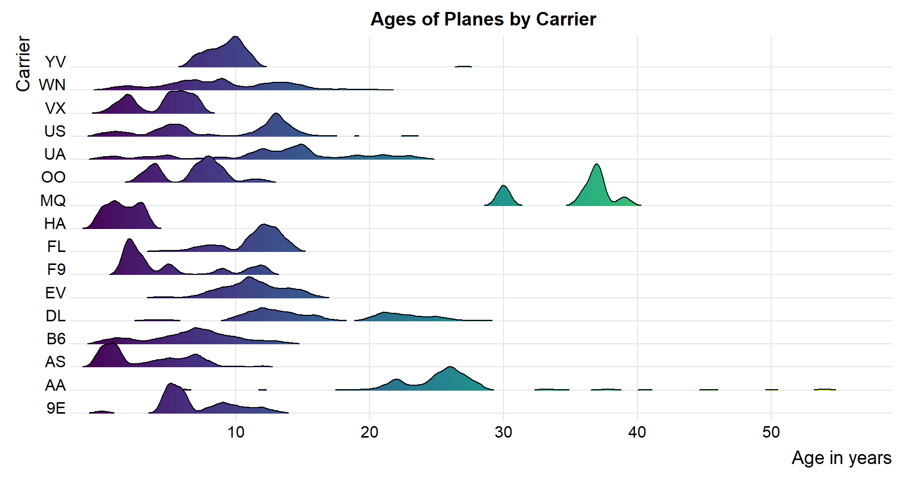

::: {.cell}

```{.r .cell-code}
library(tidyverse)
```

::: {.cell-output .cell-output-stderr}

```
Warning: package 'ggplot2' was built under R version 4.4.1
```


:::

::: {.cell-output .cell-output-stderr}

```
── Attaching core tidyverse packages ──────────────────────── tidyverse 2.0.0 ──
✔ dplyr     1.1.4     ✔ readr     2.1.5
✔ forcats   1.0.0     ✔ stringr   1.5.1
✔ ggplot2   3.5.1     ✔ tibble    3.2.1
✔ lubridate 1.9.3     ✔ tidyr     1.3.1
✔ purrr     1.0.2     
── Conflicts ────────────────────────────────────────── tidyverse_conflicts() ──
✖ dplyr::filter() masks stats::filter()
✖ dplyr::lag()    masks stats::lag()
ℹ Use the conflicted package (<http://conflicted.r-lib.org/>) to force all conflicts to become errors
```


:::

```{.r .cell-code}
library(nycflights13)
```

::: {.cell-output .cell-output-stderr}

```
Warning: package 'nycflights13' was built under R version 4.4.1
```


:::

```{.r .cell-code}
library(ggridges)
```

::: {.cell-output .cell-output-stderr}

```
Warning: package 'ggridges' was built under R version 4.4.1
```


:::

```{.r .cell-code}
library(viridis)
```

::: {.cell-output .cell-output-stderr}

```
Warning: package 'viridis' was built under R version 4.4.1
```


:::

::: {.cell-output .cell-output-stderr}

```
Loading required package: viridisLite
```


:::

```{.r .cell-code}
library(ggrepel)
```
:::

::: {.cell}

```{.r .cell-code}
planes1 <- planes %>% 
  select(-c(speed,engine))

flights1 <- flights %>% 
  select(-c(month, day, time_hour))

good1 <- flights1 %>% 
  right_join(planes1, by = "tailnum") %>% 
  right_join(airlines, by = "carrier") %>% 
  mutate("age"=year.x-year.y) %>% 
  mutate("ages" = case_when(
    age <= 10 ~ "0-10",
    age <= 20 ~ "11-20",
    age <= 30 ~ "21-30",
    TRUE ~ ">30"
  )) %>%
  mutate(ages = factor(ages, levels = c("0-10", "11-20", "21-30", ">30"))) %>%
  select(carrier, name, age, ages, distance, dep_delay, tailnum, model)

goodm <- good1 %>% 
  group_by(ages,carrier) %>% 
  summarise(mdlay = mean(dep_delay))
```

::: {.cell-output .cell-output-stderr}

```
`summarise()` has grouped output by 'ages'. You can override using the
`.groups` argument.
```


:::

```{.r .cell-code}
good <- good1 %>% 
  group_by(tailnum) %>% 
  summarise(
    distance= sum(distance)) %>% 
  right_join(good1, by = "tailnum") %>% 
  select(-distance.y) %>% 
  rename(distance = distance.x) %>% 
  group_by( tailnum, carrier, ages, distance, model) %>% 
  summarise() %>% 
  group_by(model, ages) %>% 
  summarise(distance=mean(distance))
```

::: {.cell-output .cell-output-stderr}

```
`summarise()` has grouped output by 'tailnum', 'carrier', 'ages', 'distance'.
You can override using the `.groups` argument.
`summarise()` has grouped output by 'model'. You can override using the
`.groups` argument.
```


:::

```{.r .cell-code}
top1s <- good %>%
  group_by(ages) %>%
  top_n(3, distance) %>%
  arrange(ages, -distance)
  
ggplot(good1, aes(y = dep_delay, x = as.character(ages), fill=ages)) +
  
  
  geom_boxplot(outlier.colour="grey", outlier.shape=7,outlier.size=1, show.legend = F)+
  
  scale_fill_manual(values = c("steelblue1", "steelblue2", "steelblue3", "steelblue4")) +
  
  scale_x_discrete(limits = c("0-10", "11-20", "21-30", ">30"))+
  scale_y_continuous(limits = c(-5,20))+
  theme_classic()+
  labs(
    y="Departure Delay",
    x="Age Group",
    title = "Departure Delay by Age Group"
  )+
  
  theme(
    title = element_text(family = "serif" ,size = 10),
    axis.text = element_text(size=7),
    axis.title.x = element_text(margin = margin(t = 12)),
    axis.title.y = element_text(margin = margin(r = 12)),
    plot.title = element_text(margin = margin(b=15)))
```

::: {.cell-output .cell-output-stderr}

```
Warning: Removed 113283 rows containing non-finite outside the scale range
(`stat_boxplot()`).
```


:::

::: {.cell-output-display}
{width=672}
:::
:::


## Delay distribution by age group

Even though I dislike boxplots I used them here just because! ;)

As we can see there is no significant difference in the median departure delay among age groups, if I didn't cut the data some groups have larger outliers than others. That's interesting to note!

## Age distribution by carrier

I like ggridges.

We can see that with the exceptions of American Airlines and Envoy Air (both of them having the oldest planes in general) all the others have a little similar distribution, none of them with a median greater than 20 years on their planes


::: {.cell}

```{.r .cell-code}
ggplot(good1, aes(x = age, y = as.character(carrier), fill= ..x..)) +
  
  geom_density_ridges_gradient( rel_min_height = 0.005, show.legend = F) +
  scale_fill_viridis() +
  
  scale_y_discrete(expand = c(0.01, 0)) +
  scale_x_continuous(expand = c(0.01, 0), breaks = c(10,20,30,40,50))+
  
  labs(
    x="Age in years",
    y="Carrier",
    title= "Ages of Planes by Carrier"
  )+
  theme_ridges()+
  
  theme(
    plot.title = element_text(hjust = .5)
  )
```

::: {.cell-output .cell-output-stderr}

```
Warning: The dot-dot notation (`..x..`) was deprecated in ggplot2 3.4.0.
ℹ Please use `after_stat(x)` instead.
```


:::

::: {.cell-output .cell-output-stderr}

```
Picking joint bandwidth of 0.476
```


:::

::: {.cell-output-display}
{width=912}
:::
:::


## Planes usage by age group

I actually did like three things but ended up doing this one that I like, as you can see disregarding carrier, there are always some models that are used more per decade in the industry. Specially the 700 models have been very popular for a while


::: {.cell}

```{.r .cell-code}
custom_labels <- c("0-10 Years", "11-20 Years", "21-30 Years", ">30 Years")
custom_labeller <- function(variable, value) {
  return(custom_labels[value])
}

ggplot(good, aes(model, distance, col=distance, size=distance)) + 
  geom_point(show.legend = F)+
  facet_wrap(vars(ages), nrow = 1, labeller = labeller(ages = custom_labeller))+
  
  scale_color_viridis(option = "G", direction = -1)+
  
  scale_y_continuous(trans="sqrt", breaks = seq(1000,1000000, by=100000), labels = c("100,000", "200,000", "300,000", "400,000", "500,000", "600,000", "700,000", "800,000", "900,000", "1000,000"))+
  
  geom_label_repel(data = top1s, aes(label = model), color="grey25", show.legend = F)+
  
  theme_bw()+
  labs(
    y="Average Distance per Model (Mi)",
    x=" ",
    title = "Most Used Airplane Models by Age Group"
  )+
  
   
    theme(
    axis.text.y = element_text(angle = 35),
    axis.text.x = element_blank(),
    axis.ticks = element_blank(),
    plot.title = element_text(size=15, hjust = .5),
    panel.grid.major = element_blank(),
    panel.grid.minor = element_blank(),
    strip.text = element_text(size = 11, angle = 0, colour = "white"),
    strip.background = element_rect(colour = "black", fill = "steelblue")
  )
```

::: {.cell-output-display}
{width=1008}
:::
:::


I
