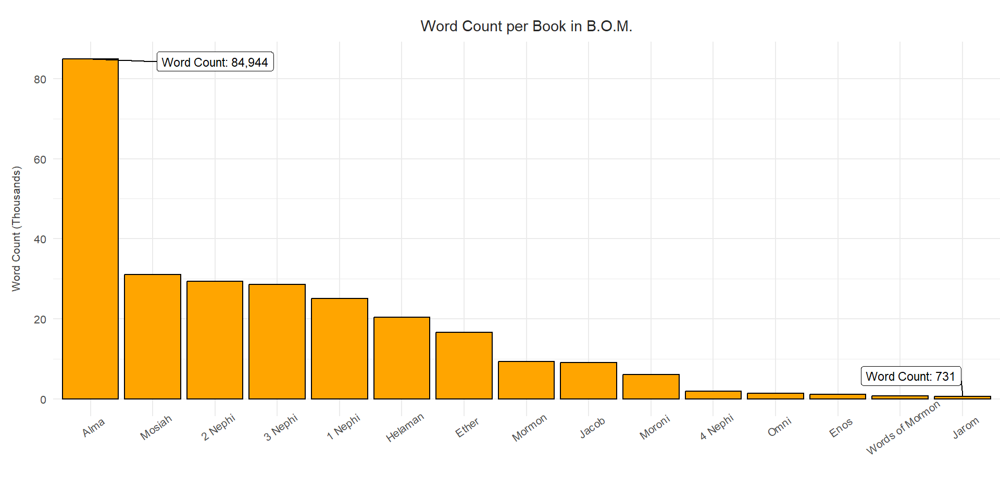

::: {.cell}

```{.r .cell-code}
library(tidyverse)
```

::: {.cell-output .cell-output-stderr}

```
Warning: package 'ggplot2' was built under R version 4.4.1
```


:::

::: {.cell-output .cell-output-stderr}

```
── Attaching core tidyverse packages ──────────────────────── tidyverse 2.0.0 ──
✔ dplyr     1.1.4     ✔ readr     2.1.5
✔ forcats   1.0.0     ✔ stringr   1.5.1
✔ ggplot2   3.5.1     ✔ tibble    3.2.1
✔ lubridate 1.9.3     ✔ tidyr     1.3.1
✔ purrr     1.0.2     
── Conflicts ────────────────────────────────────────── tidyverse_conflicts() ──
✖ dplyr::filter() masks stats::filter()
✖ dplyr::lag()    masks stats::lag()
ℹ Use the conflicted package (<http://conflicted.r-lib.org/>) to force all conflicts to become errors
```


:::

```{.r .cell-code}
library(ggrepel)
library(scales)
```

::: {.cell-output .cell-output-stderr}

```

Attaching package: 'scales'

The following object is masked from 'package:purrr':

    discard

The following object is masked from 'package:readr':

    col_factor
```


:::
:::

::: {.cell}

```{.r .cell-code}
dt <- rio::import("http://scriptures.nephi.org/downloads/lds-scriptures.csv.zip") |> 
  as_tibble() |> 
  rename( title = volume_title,
          text = scripture_text,
          book = book_title ) |> 
  mutate(count = str_count(text, "\\S+"))

nt <- dt |> 
  filter(title == "New Testament")

bm <- dt |> 
  filter(title == "Book of Mormon")
```
:::


## Word counts and averages


::: {.cell}

```{.r .cell-code}
ntmn <- mean(nchar(nt$text))
bmmn <- mean(nchar(bm$text))

ntcnt <- sum(grepl("Jesus", nt$text))
bmcnt <- sum(grepl("Jesus", bm$text))

dt2 <- matrix(
  c(round(ntmn), round(ntcnt), round(bmmn), round(bmcnt)),
  nrow = 2,
  ncol = 2,
  dimnames = list(c("Mean Verse Length", "Jesus Word Count"), c("New Testament", "Book of Mormon"))
)

pander::pander(dt2, caption = "This is the word count and averages per book")
```

::: {.cell-output-display}

--------------------------------------------------------
        &nbsp;           New Testament   Book of Mormon 
----------------------- --------------- ----------------
 **Mean Verse Length**        118             213       

 **Jesus Word Count**         935             161       
--------------------------------------------------------

Table: This is the word count and averages per book


:::
:::


## Word count per book in the book of mormon


::: {.cell}

```{.r .cell-code}
bm1 <- bm |> 
  group_by(book) |> 
  summarise( count = sum(count))

max_count <- max(bm1$count)
min_count <- min(bm1$count)

ggplot(bm1, aes(reorder(book, -count), count)) + 
  
  geom_col(col="black", fill="orange") +
  
  scale_y_continuous(labels = c("0","20","40","60","80"))+
  
  geom_label_repel(data = subset(bm1, count == max_count), 
                   aes(label = paste("Word Count:", comma(count))), 
                   color = "black", size = 3, box.padding = 0.5, 
                   fill = "white", nudge_x = 2) +
  
  geom_label_repel(data = subset(bm1, count == min_count), 
                   aes(label = paste("Word Count:", comma(count))), 
                   color = "black", size = 3, box.padding = 0.5, 
                   fill = "white", nudge_y = 1000 ) +
  
  theme_minimal()+
  
  labs(title = "Word Count per Book in B.O.M.",
       x=" ",
       y="Word Count (Thousands)") +
  
  theme(
    plot.margin = margin(.5,0,0,.5,"cm"),
    plot.title = element_text(hjust = .5, size=11, colour="grey15"),
    axis.title.y = element_text(size=8, colour = "grey25", vjust = 5),
    axis.text.x = element_text(size=8, angle = 35),
    axis.text.y = element_text(size=8)
  )
```

::: {.cell-output-display}
{width=960}
:::
:::


We see that Alma being the longest book in the book of mormon has the largest count, abd that Jarom being the shortest book in length, has the fewest words. So this makes sense