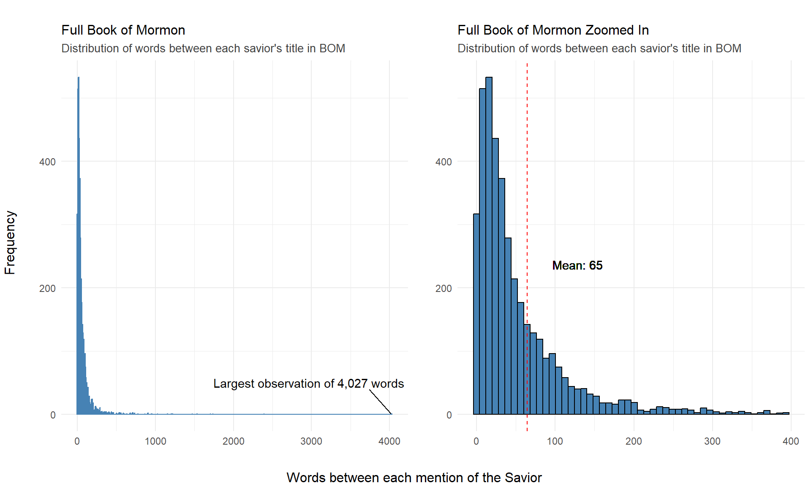

::: {.cell}

```{.r .cell-code}
library(tidyverse)
```

::: {.cell-output .cell-output-stderr}

```
Warning: package 'ggplot2' was built under R version 4.4.1
```


:::

::: {.cell-output .cell-output-stderr}

```
── Attaching core tidyverse packages ──────────────────────── tidyverse 2.0.0 ──
✔ dplyr     1.1.4     ✔ readr     2.1.5
✔ forcats   1.0.0     ✔ stringr   1.5.1
✔ ggplot2   3.5.1     ✔ tibble    3.2.1
✔ lubridate 1.9.3     ✔ tidyr     1.3.1
✔ purrr     1.0.2     
── Conflicts ────────────────────────────────────────── tidyverse_conflicts() ──
✖ dplyr::filter() masks stats::filter()
✖ dplyr::lag()    masks stats::lag()
ℹ Use the conflicted package (<http://conflicted.r-lib.org/>) to force all conflicts to become errors
```


:::

```{.r .cell-code}
library(httr)
library(stringr)
library(ggrepel)
library(scales)
```

::: {.cell-output .cell-output-stderr}

```

Attaching package: 'scales'

The following object is masked from 'package:purrr':

    discard

The following object is masked from 'package:readr':

    col_factor
```


:::

```{.r .cell-code}
library(gridExtra)
```

::: {.cell-output .cell-output-stderr}

```

Attaching package: 'gridExtra'

The following object is masked from 'package:dplyr':

    combine
```


:::

```{.r .cell-code}
library(grid)
library(png)
```
:::

::: {.cell}

```{.r .cell-code}
url <- "https://byuistats.github.io/M335/data/BoM_SaviorNames.rds"
temp_file <- tempfile()
GET(url, write_disk(temp_file))
```

::: {.cell-output .cell-output-stdout}

```
Response [https://byuistats.github.io/M335/data/BoM_SaviorNames.rds]
  Date: 2024-09-13 00:39
  Status: 200
  Content-Type: application/octet-stream
  Size: 9.05 kB
<ON DISK>  C:\Users\12089\AppData\Local\Temp\RtmpSU44H5\file6520568b1293
```


:::

```{.r .cell-code}
snm <- readRDS(temp_file)|> 
  as_tibble()

unlink(temp_file)

dt <- rio::import("http://scriptures.nephi.org/downloads/lds-scriptures.csv.zip") |> 
  as_tibble()|> 
  rename( title = volume_title,
          text = scripture_text,
          book = book_title,
          reference = verse_title )|> 
  filter(title == "Book of Mormon")

#Counts

text <- paste(dt$text, collapse = " ")

names <- snm$name

pattern <- paste(names, collapse = "|")

divs <- str_split(text, pattern)[[1]] |> 
  trimws()

counts <- tibble(text = divs) |> 
  mutate(
    text = str_replace(text, "^[[:punct:]]+", ""),
    count = str_count(text, "\\S+")) |> 
  filter(count != 0)

avg <- mean(counts$count)
```
:::


#principal


::: {.cell}

```{.r .cell-code}
largest_x <- max(counts$count)

f1 <- ggplot(counts, aes(count)) +
  geom_histogram(bins = 500, col = "steelblue") +
  theme_minimal() +
  labs(
    title = "Full Book of Mormon",
    subtitle = "Distribution of words between each savior's title in BOM",
    x = "",
    y = "") +
  theme(
    plot.title = element_text(size = 12),
    plot.subtitle = element_text(size = 10, color = "grey25")) +
  geom_text_repel(aes(label = ifelse(count == largest_x, paste(
      "Largest observation of", comma(largest_x), "words"), ""),y = 0),
    nudge_x = 10, nudge_y = 50)

f2 <- ggplot(counts, aes(count)) +
  geom_histogram(data = subset(counts, count < 400), bins = 50, fill = "steelblue", color = "black") + 
  geom_text(aes(x = avg, y = 200, label = paste("Mean:", round(avg))), 
            color = "black", hjust = -.5, vjust = -2) +
  geom_vline(xintercept = avg, color = "red", linetype = "dashed")+
  theme_minimal() +
  labs(
    title = "Full Book of Mormon Zoomed In",
    subtitle = "Distribution of words between each savior's title in BOM",
    x = "",
    y = "" ) +
  theme(plot.title = element_text(size = 12),
        plot.subtitle = element_text(size = 10, color = "grey25"))

plot <- grid.arrange(f1, f2,
             ncol = 2,
             top = textGrob("", gp = gpar(fontsize = 12, col = "black")),
             left = textGrob("Frequency", rot = 90, gp = gpar(fontsize = 12)),
             bottom = textGrob("Words between each mention of the Savior", gp = gpar(fontsize = 12))
             )
```

::: {.cell-output .cell-output-stderr}

```
Warning in geom_text(aes(x = avg, y = 200, label = paste("Mean:", round(avg))), : All aesthetics have length 1, but the data has 4055 rows.
ℹ Please consider using `annotate()` or provide this layer with data containing
  a single row.
```


:::

::: {.cell-output-display}
{width=960}
:::

```{.r .cell-code}
ggsave("plot.png", plot = plot, width = 10, height = 6, units = "in", dpi = 300)
```
:::

::: {.cell}

```{.r .cell-code}
png_file <- "plot.png"
img <- readPNG(png_file)
grid::grid.raster(img)
```

::: {.cell-output-display}
{width=960}
:::
:::


We see that the lengths between the savior's titles don't follow a normal distribution, it's more of a heavy tailed, left skewed distribution. But overall, the mean between each instance of one of the savior's title's is of 65 words. It's interesting that they're not very far away from each other. Even disregarding a large outlier where the distance is of around 4,000 words in Alma, the overall book mean distance is still small of 65 words between each savior's title, which is around 1 or 2 verses.


